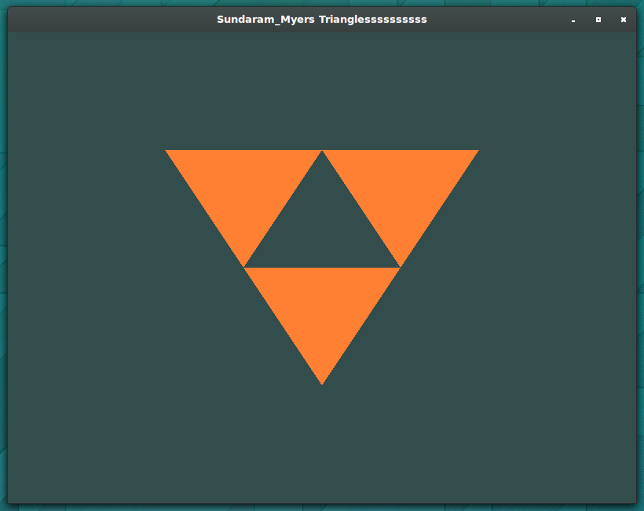
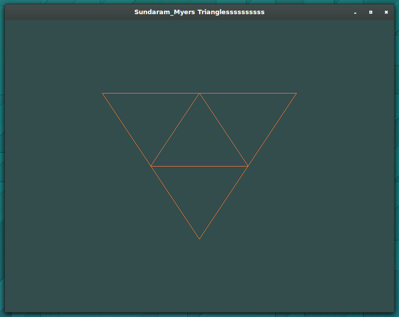

# SPR18_graphics_project

## Basic Triangles
Based on the code provided, we modified the code to show the following:

The `m` key can be pressed to cycle between the three polygon display modes
provided by OpenGL.

## Museum Plans
* Multi-Themed Museum, each room having its own theme
* starting with 4 rooms
* 
* 
